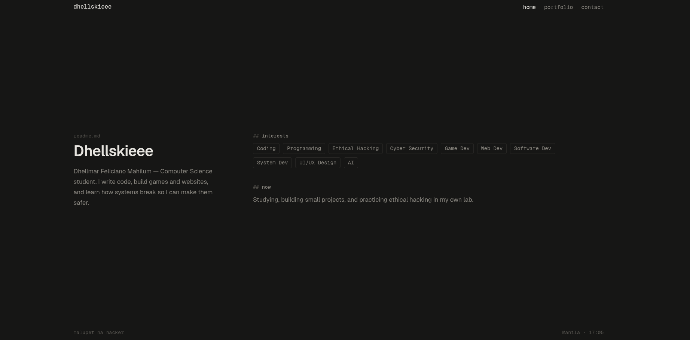
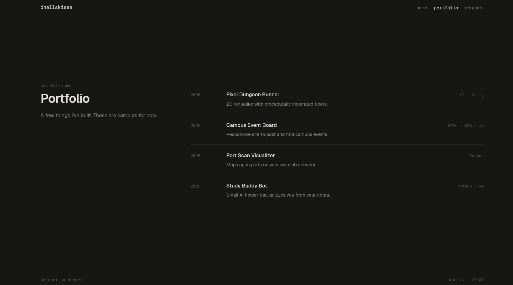
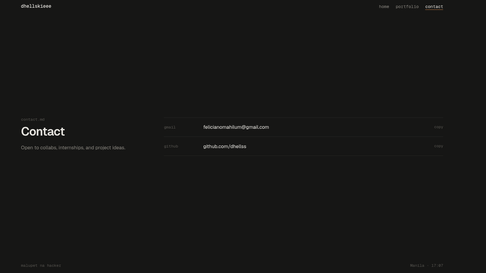

 Readme

**Vibe:** calm, editorial, most "professional"

The site reads like a README file — `readme.md`, `portfolio.md`, `contact.md`. No gimmicks, just typography.

- **Pages:** home · portfolio · contact
- **Layout:** two columns on desktop — the title and intro stay pinned on the left while the content sits on the right; stacks into one column on phones.
- **Interactions:** copy buttons with a toast, live Manila clock in the footer.
- **Tech:** Geist + Geist Mono, warm orange accent (`#D98A4A`).

     

     

     

     